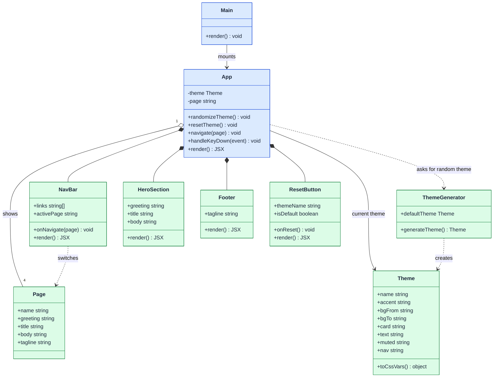

# MIAO-WEBSITE: Class Diagram & Class Model

## Class Diagram

## Class Model

| Class | Attributes | Methods | Responsibility |
|---|---|---|---|
| Main | — | render() | Creates the React root and mounts App in StrictMode. |
| App | theme, page (state) | randomizeTheme(), resetTheme(), navigate(), handleKeyDown(), render() | Page layout. Clicking the card gives a random theme, a nav link switches the page, and the reset button restores the normal theme. |
| Theme | name, accent, bgFrom, bgTo, card, text, muted, nav | toCssVars() | One color theme. Changes colors only, never the page text. Lives in `src/models/Theme.js`. |
| ThemeGenerator | defaultTheme, word lists | generateTheme() | Builds a random color theme (light or dark) with a fun name. Lives in `src/models/ThemeGenerator.js`. |
| Page | name, greeting, title, body, tagline | — | Text for Home, About, Projects and Contact. Fixed: themes never change it. Lives in `src/models/Page.js` and `src/models/pages.js`. |
| NavBar | links, activePage | onNavigate(), render() | Top navigation; highlights the current page. |
| HeroSection | greeting, title, body | render() | Greeting, title, bar and optional paragraph. |
| Footer | tagline | render() | Tagline line at the bottom of the card. |
| ResetButton | themeName, isDefault | onReset(), render() | Shows the current theme name and a "Back to normal" button (disabled when already normal). |
